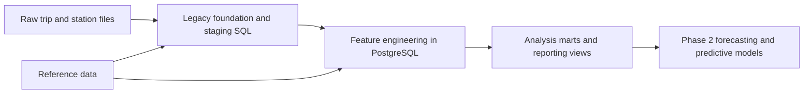

# Architecture

## Goal

Reframe the repository from a flat SQL analysis dump into a SQL-first warehouse analytics project that is easier to maintain, easier to present, and easier to extend.

## Design principles

- Keep transformations close to the database.
- Separate raw inputs, staging logic, feature engineering, marts, and enrichment.
- Preserve the original work instead of rewriting history.
- Add just enough engineering discipline to make the project feel intentional and modern.
- Keep predictive modeling out of phase 1 so the foundation stays clean.

## Layered design

## Repository layers

### `data/`

Local working datasets grouped by raw and reference domains.

### `sql/legacy/`

Original SQL assets preserved and reorganized into:

- `foundation/`: bootstrap objects, helper functions, and initial loading logic
- `staging/`: quarter-level trip cleanup and standardization
- `features/`: database-side classification and clustering logic
- `marts/`: analysis-ready views and yearly rollups
- `enrichment/`: demographic and transit reference joins

### `sql/warehouse/`

New warehouse-oriented assets added during the restructuring effort:

- contracts and inventories
- orchestration notes and runbooks
- reusable SQL utilities needed by multiple scripts

### `scripts/` and `tests/`

Project validation assets that make the repo feel more engineering-minded:

- repository contract validation
- lightweight unit tests around structure and source manifests

## Why the SQL-first framing matters

This project can now be presented as a practical example of database-oriented analytics engineering:

- loading and cleaning large trip datasets in PostgreSQL
- feature creation close to the warehouse
- reduced need for repeated database-to-Python data movement
- better alignment with data engineering and platform-oriented roles

## Deferred work

The following items are intentionally phase 2:

- complete source reconciliation
- stronger business-rule testing on the actual trip facts
- canonical warehouse schemas that replace every legacy naming pattern
- predictive, time-series, and forecasting layers

